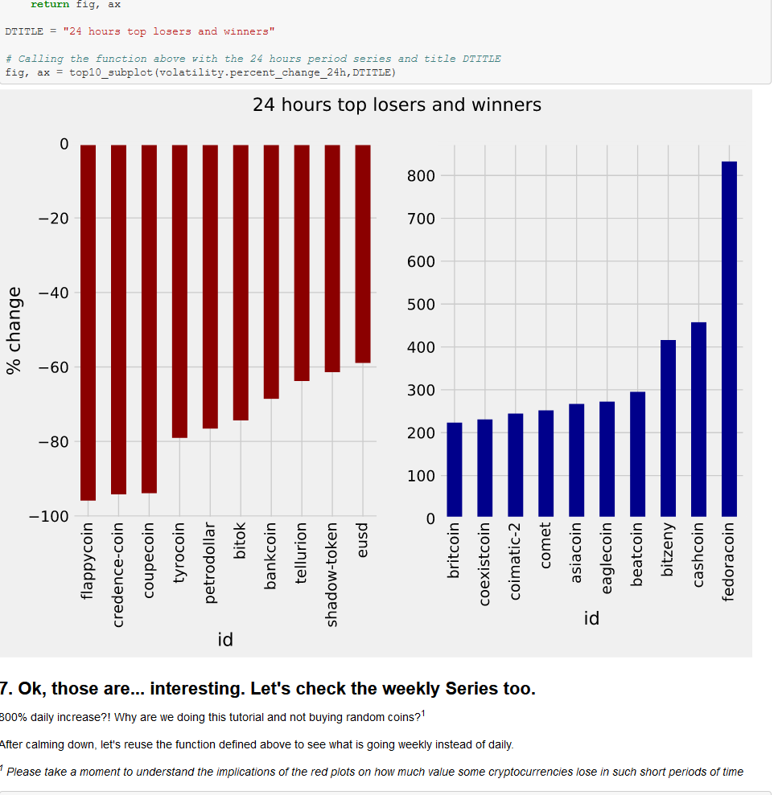

# Exploring-the-Bitcoin-Cryptocurrency-Market
<h4>To better understand the growth and impact of Bitcoin and other cryptocurrencies, in this project, I explore the market capitalization of different cryptocurrencies.</h4> 
<h4>Skills required to complete this project :<h4>
<ul>
  <li>
       Pandas Foundations
  </li>
  <li>
       Manipulating DataFrames with pandas
  </li>
  <li>
       Cleaning Data in Python
  </li>
</ul>

